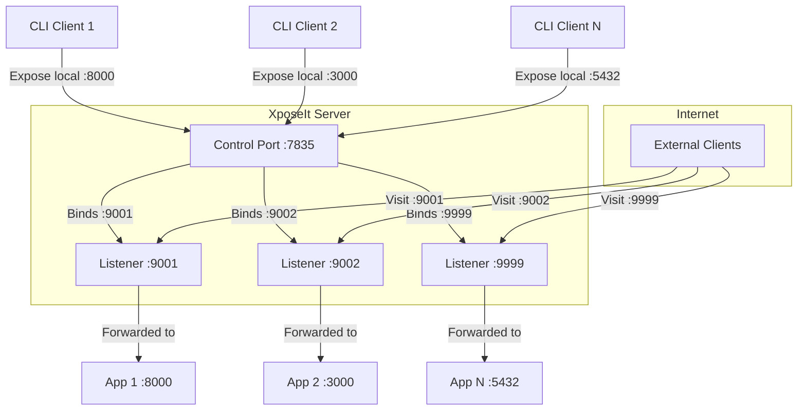
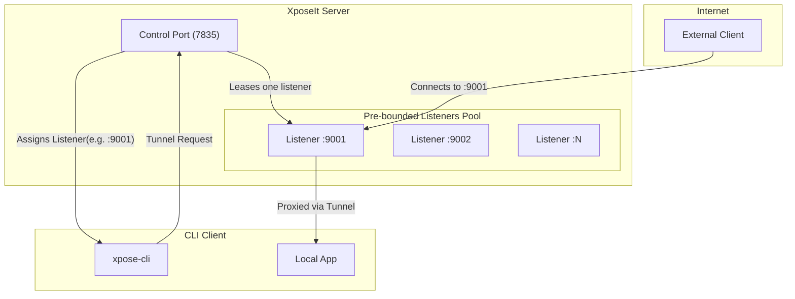
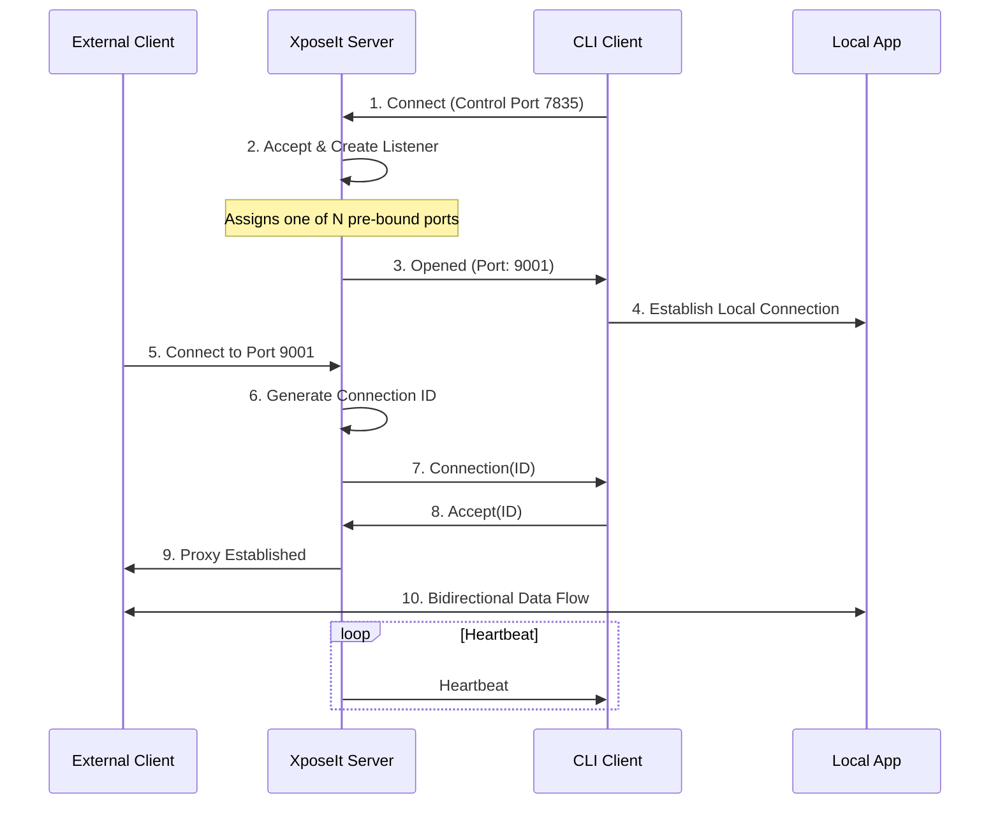

# XposeIt

Instantly expose your local applications to the internet. XposeIt is a high-performance TCP port forwarding service written in Rust that allows you to securely tunnel traffic from the internet to your local applications.

## Table of Contents

- [Features](#features)
- [Architecture](#architecture)
- [Quick Start](#quick-start)
- [Installation](#installation)
- [Usage](#usage)
- [How It Works](#how-it-works)

## Features

- **High Performance**: Built with async Rust and Tokio for minimal latency
- **Concurrent Connections**: Handles multiple concurrent port forwarding sessions
- **Observability**: Structured logging with tracing for debugging and monitoring
- **Cross-Platform**: Works on Linux, macOS, and Windows

## Architecture



```mermaid
flowchart TB
 subgraph S["XposeIt Server"]
        CP["Control Port :7835"]
        FWD1["Listener :9001"]
        FWD2["Listener :9002"]
        FWDN["Listener :9999"]
  end
 subgraph I["Internet"]
        EXT["External Clients"]
  end
    CLI1["CLI Client 1"] -- Expose local :8000 --> CP
    CLI2["CLI Client 2"] -- Expose local :3000 --> CP
    CLIN["CLI Client N"] -- Expose local :5432 --> CP
    CP -- Binds :9001 --> FWD1
    CP -- Binds :9002 --> FWD2
    CP -- Binds :9999 --> FWDN
    EXT -- Visit :9001 --> FWD1
    EXT -- Visit :9002 --> FWD2
    EXT -- Visit :9999 --> FWDN
    FWD1 -- Forwarded to --> APP1["App 1 :8000"]
    FWD2 -- Forwarded to --> APP2["App 2 :3000"]
    FWDN -- Forwarded to --> APPN["App N :5432"]
```

**Components**:
- **Server**: Pre-binds N forwarding ports at startup, manages control connections, routes traffic
- **CLI Client**: Connects to server, requests a forwarding port, proxies local app

## Quick Start

### 1. Build the binaries
```bash
cargo build --release
```

### 2. Start the server
```bash
./target/release/xpose-server
```

The server will:
- Listen on port 7835 for control connections
- Be ready to allocate ports for forwarding

### 3. Expose your local app
In another terminal:
```bash
./target/release/xpose-cli --port 8000
```

This will:
- Connect to the server
- Request a forwarding port
- Display the allocated port number
- Start forwarding traffic to `localhost:8000`

### 4. Access your app
Now your local app is accessible via the server's IP/hostname on the allocated port:
```bash
curl http://server-host:allocated-port
```

## Installation

### From Source

1. **Install Rust** (if not already installed):
   ```bash
   curl --proto '=https' --tlsv1.2 -sSf https://sh.rustup.rs | sh
   ```

2. **Clone the repository**:
   ```bash
   git clone https://github.com/mohidex/xposeit.git
   cd xposeit
   ```

3. **Build the project**:
   ```bash
   cargo build --release
   ```

4. **Binaries are located at**:
   - Server: `./target/release/xpose-server`
   - CLI: `./target/release/xpose-cli`

## Usage

### Basic Setup

#### Terminal 1: Start the server
```bash
./xpose-server
```

#### Terminal 2: Start your local app
```bash
# Example: Simple HTTP server
python3 -m http.server 8000
```

#### Terminal 3: Expose the port
```bash
./xpose-cli --port 8000
```

Output:
```
Listening at localhost:9001
Your localhost:8000 server is accessible through localhost:9001
```

#### Terminal 4: Access your app
```bash
curl http://localhost:9001
```

## How It Works


### System Architecture


```mermaid
flowchart TD
    subgraph Server["XposeIt Server"]
        CP["Control Port (7835)"]
        subgraph Listeners["Pre-bounded Listeners Pool"]
            L1["Listener :9001"]
            L2["Listener :9002"]
            LN["Listener :N"]
        end
    end

    subgraph Client["CLI Client"]
        CLI["xpose-cli"]
        LA["Local App"]
    end

    subgraph Internet["Internet"]
        EXT["External Client"]
    end

    CLI -- "Tunnel Request" --> CP
    CP -- "Assigns Listener(e.g. :9001)" --> CLI
    CP -- "Leases one listener" --> L1

    EXT -- "Connects to :9001" --> L1
    L1 -- "Proxied via Tunnel" --> LA

```

### Connection Flow Sequence


```mermaid
sequenceDiagram
    participant EC as External Client
    participant Server as XposeIt Server
    participant CLI as CLI Client
    participant App as Local App
    
    CLI->>Server: 1. Connect (Control Port 7835)
    Server->>Server: 2. Accept & Create Listener
    
    Note over Server: Assigns one of N pre-bound ports
    Server->>CLI: 3. Opened (Port: 9001)
    
    CLI->>App: 4. Establish Local Connection
    
    EC->>Server: 5. Connect to Port 9001
    Server->>Server: 6. Generate Connection ID
    Server->>CLI: 7. Connection(ID)
    
    CLI->>Server: 8. Accept(ID)
    Server->>EC: 9. Proxy Established
    
    EC<<->>App: 10. Bidirectional Data Flow
    
    loop Heartbeat
        Server->>CLI: Heartbeat
    end
```


### Building

**Debug build**:
```bash
cargo build
```

**Release build** (optimized):
```bash
cargo build --release
```

### Testing

Run the test suite:
```bash
cargo test
```

With logging:
```bash
RUST_LOG=debug cargo test -- --nocapture
```

### Code Quality

Check for issues:
```bash
cargo clippy
```

Format code:
```bash
cargo fmt
```
### Logging and Debugging

Set log level:
```bash
RUST_LOG=debug ./xpose-server
RUST_LOG=info ./xpose-cli --port 8000
```

Available levels: `error`, `warn`, `info`, `debug`, `trace`

---

## Contributing

Contributions are welcome! Please feel free to submit pull requests.

---

Happy exposing! 🚀
