# XposeIt

Instantly expose your local applications to the internet. XposeIt is a high-performance TCP port forwarding service written in Rust that allows you to securely tunnel traffic from the internet to your local applications.

## Table of Contents

- [Features](#features)
- [Architecture](#architecture)
- [Quick Start](#quick-start)
- [Installation](#installation)
- [Configuration](#configuration)
- [Usage](#usage)
- [How It Works](#how-it-works)
- [Troubleshooting](#troubleshooting)

## Features

- **High Performance**: Built with async Rust and Tokio for minimal latency
- **Concurrent Connections**: Handles multiple concurrent port forwarding sessions
- **Configurable**: YAML-based configuration for easy customization
- **Observability**: Structured logging with tracing for debugging and monitoring
- **Cross-Platform**: Works on Linux, macOS, and Windows

## Architecture


**Components**:
- **Server**: Manages control connections, allocates ports, routes traffic
- **CLI Client**: Connects to server, establishes tunnel, maintains connection

## Quick Start

### 1. Build the binaries
```bash
cargo build --release
```

### 2. Start the server
```bash
./target/release/xpose-server
```

The server will:
- Load configuration from `config.yaml` (or use defaults)
- Listen on port 7835 for control connections
- Be ready to allocate ports for forwarding

### 3. Expose your local app
In another terminal:
```bash
./target/release/xpose-cli --port 8000
```

This will:
- Connect to the server
- Request a forwarding port
- Display the allocated port number
- Start forwarding traffic to `localhost:8000`

### 4. Access your app
Now your local app is accessible via the server's IP/hostname on the allocated port:
```bash
curl http://server-host:allocated-port
```

## Installation

### From Source

1. **Install Rust** (if not already installed):
   ```bash
   curl --proto '=https' --tlsv1.2 -sSf https://sh.rustup.rs | sh
   ```

2. **Clone the repository**:
   ```bash
   git clone https://github.com/mohidex/xposeit.git
   cd xposeit
   ```

3. **Build the project**:
   ```bash
   cargo build --release
   ```

4. **Binaries are located at**:
   - Server: `./target/release/xpose-server`
   - CLI: `./target/release/xpose-cli`

## Configuration

XposeIt uses YAML-based configuration for easy customization. All server settings can be configured without recompiling.

### Configuration File

Create a `config.yaml` in your working directory:

```yaml
server:
  # Port on which the control server listens (default: 7835)
  control_port: 7835

  # Port range for forwarded connections
  min_port: 1024
  max_port: 65535

  # Maximum number of times to regenerate the port pool
  # when searching for available ports (default: 150)
  max_retry_attempts: 150

  # Timeout in milliseconds for heartbeat and accept operations (default: 500)
  heartbeat_timeout_ms: 500

  # Timeout in milliseconds for control message checks (default: 100)
  control_message_timeout_ms: 100

  # Timeout in seconds for stale connection cleanup (default: 10)
  stale_connection_timeout_secs: 10
```

### Using Configuration

**Default behavior** (uses built-in defaults):
```bash
./target/release/xpose-server
```

**With custom config file**:
```bash
./target/release/xpose-server --config /path/to/config.yaml
```

**Override config via CLI arguments**:
```bash
./target/release/xpose-server --config config.yaml --min-port 5000 --max-port 9999
```

## Usage

### Basic Setup

#### Terminal 1: Start the server
```bash
./xpose-server
```

#### Terminal 2: Start your local app
```bash
# Example: Simple HTTP server
python3 -m http.server 8000
```

#### Terminal 3: Expose the port
```bash
./xpose-cli --port 8000
```

Output:
```
Listening at localhost:22847
Your localhost:8000 server is accessible through localhost:22847
```

#### Terminal 4: Access your app
```bash
curl http://localhost:22847
```

### Advanced Examples

**Expose multiple services**:
```bash
# Terminal 2
./xpose-cli --port 8000  # Web app

# Terminal 3
./xpose-cli --port 3000  # API server

# Terminal 4
./xpose-cli --port 5432  # Database
```

**Custom configuration for high-traffic scenarios**:
```yaml
server:
  control_port: 7835
  min_port: 10000
  max_port: 60000
  heartbeat_timeout_ms: 1000
  control_message_timeout_ms: 200
  stale_connection_timeout_secs: 30
```

## How It Works

### System Architecture

```mermaid
graph TB
    Client["🌐 External Client<br/>(Internet)"]
    Server["🖥️ XposeIt Server<br/>(Control Port: 7835)"]
    LocalApp["💻 Local App<br/>(localhost:8000)"]
    
    CLI["📱 CLI Client<br/>(xpose-cli)"]
    
    Client -->|1. Connection| Server
    Server -->|2. Allocate Port| CLI
    CLI -->|3. Open Tunnel| LocalApp
    Client -->|4. Data Flow| Server
    Server -->|5. Proxy| LocalApp
    
    style Server fill:#4A90E2,stroke:#2E5C8A,color:#fff
    style Client fill:#7ED321,stroke:#5FA91A,color:#fff
    style LocalApp fill:#F5A623,stroke:#C17F1A,color:#fff
    style CLI fill:#9013FE,stroke:#5E0AA1,color:#fff
```



### Connection Flow Sequence


### Building

**Debug build**:
```bash
cargo build
```

**Release build** (optimized):
```bash
cargo build --release
```

### Testing

Run the test suite:
```bash
cargo test
```

With logging:
```bash
RUST_LOG=debug cargo test -- --nocapture
```

### Code Quality

Check for issues:
```bash
cargo clippy
```

Format code:
```bash
cargo fmt
```

## Troubleshooting

### Port Already in Use

**Error**: `error: Address already in use`

**Solution**: 
- Change the `control_port` in `config.yaml`
- Or kill the process using the port: `lsof -ti:7835 | xargs kill -9`

### Connection Refused

**Error**: `Connection refused` when trying to expose a port

**Solution**:
- Ensure the server is running: `./xpose-server`
- Check the server is listening on the right port: `netstat -ln | grep 7835`
- Verify firewall isn't blocking the port

### Port Allocation Failures

**Error**: `failed to find an available port after exhausting all port pools`

**Solution**:
- Increase the port range in `config.yaml`:
  ```yaml
  min_port: 1024
  max_port: 65535
  ```
- Increase `max_retry_attempts`
- Check system has available ports: `netstat -an | grep LISTEN | wc -l`

### High Latency

**Issue**: Connections seem slow

**Solution**:
- Check network latency: `ping server-host`
- Increase `heartbeat_timeout_ms` in `config.yaml` if on slow networks
- Consider reducing client-side connection retries

### Memory Usage Growing

**Issue**: Server memory increases over time

**Solution**:
- Ensure clients are properly disconnecting
- Check `stale_connection_timeout_secs` - may need adjustment
- Monitor with: `ps aux | grep xpose-server`

## Advanced Topics

### Custom Port Ranges

For embedded systems or restricted environments:
```yaml
server:
  min_port: 8000
  max_port: 8100
```

This limits to a smaller range, useful for:
- Embedded systems with limited resources
- Docker containers with restricted port access
- Testing

### Logging and Debugging

Set log level:
```bash
RUST_LOG=debug ./xpose-server
RUST_LOG=info ./xpose-cli --port 8000
```

Available levels: `error`, `warn`, `info`, `debug`, `trace`

---

## Contributing

Contributions are welcome! Please feel free to submit pull requests.

## License

See LICENSE file for details.

---

Happy exposing! 🚀
